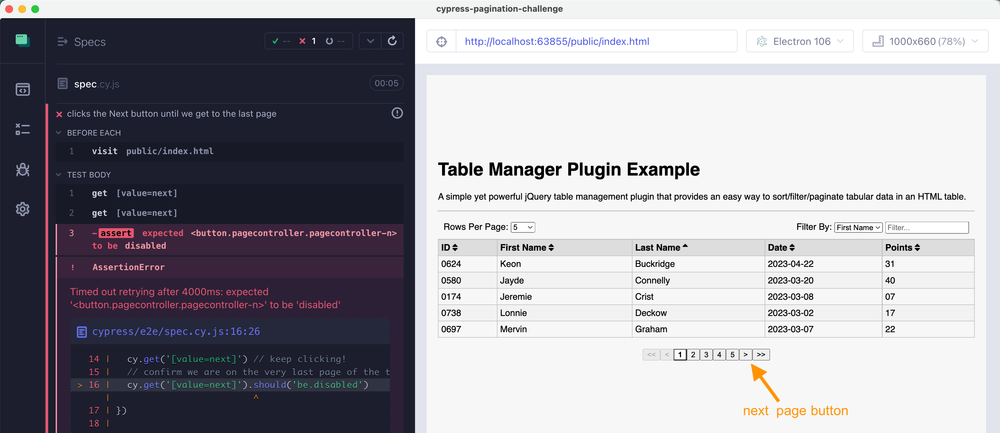

# cypress-pagination-challenge

📺 Watch the introduction in [Cypress Pagination Challenge](https://youtu.be/DgUIfQLFOcM)

Can you implement the following test using Cypress? You can write plain Cypress code or use [any plugins](https://cypress.tips/courses/cypress-plugins), but the code has to be:

1. correct
2. elegant
3. easy to maintain

There is a starter spec [cypress/e2e/spec.cy.js](./cypress/e2e/spec.cy.js) that visits the page and confirms we are on the last paginated table page. The test fails because you haven't implemented the "meat" of the test.



**Bonus question:** can you solve this problem in several different ways?

## Edge cases

After solving the current problem, check if your solution still works if the table has only 3 entries instead of 23, and thus the next button is disabled at the start. Modify the `app.js` [file](https://github.com/bahmutov/cypress-pagination-challenge/blob/main/public/app.js#L6)

```diff
- for (let i = 0; i < 23; i++) {
+ for (let i = 0; i < 3; i++) {
```

Does your solution work?

## Use

Requires Node v16+. No need to start anything else.

Install dependencies and open Cypress

```
$ npm install
$ npx cypress open
```

## Small print

Author: Gleb Bahmutov &lt;gleb.bahmutov@gmail.com&gt; &copy; 2023

- [@bahmutov](https://twitter.com/bahmutov)
- [glebbahmutov.com](https://glebbahmutov.com)
- [blog](https://glebbahmutov.com/blog)
- [videos](https://www.youtube.com/glebbahmutov)
- [presentations](https://slides.com/bahmutov)
- [cypress.tips](https://cypress.tips)

License: MIT - do anything with the code, but don't blame me if it does not work.

Support: if you find any problems with this module, email / tweet /
[open issue](https://github.com/bahmutov/cypress-recurse/issues) on Github

## MIT License

Copyright (c) 2023 Gleb Bahmutov &lt;gleb.bahmutov@gmail.com&gt;

Permission is hereby granted, free of charge, to any person
obtaining a copy of this software and associated documentation
files (the "Software"), to deal in the Software without
restriction, including without limitation the rights to use,
copy, modify, merge, publish, distribute, sublicense, and/or sell
copies of the Software, and to permit persons to whom the
Software is furnished to do so, subject to the following
conditions:

The above copyright notice and this permission notice shall be
included in all copies or substantial portions of the Software.

THE SOFTWARE IS PROVIDED "AS IS", WITHOUT WARRANTY OF ANY KIND,
EXPRESS OR IMPLIED, INCLUDING BUT NOT LIMITED TO THE WARRANTIES
OF MERCHANTABILITY, FITNESS FOR A PARTICULAR PURPOSE AND
NONINFRINGEMENT. IN NO EVENT SHALL THE AUTHORS OR COPYRIGHT
HOLDERS BE LIABLE FOR ANY CLAIM, DAMAGES OR OTHER LIABILITY,
WHETHER IN AN ACTION OF CONTRACT, TORT OR OTHERWISE, ARISING
FROM, OUT OF OR IN CONNECTION WITH THE SOFTWARE OR THE USE OR
OTHER DEALINGS IN THE SOFTWARE.
